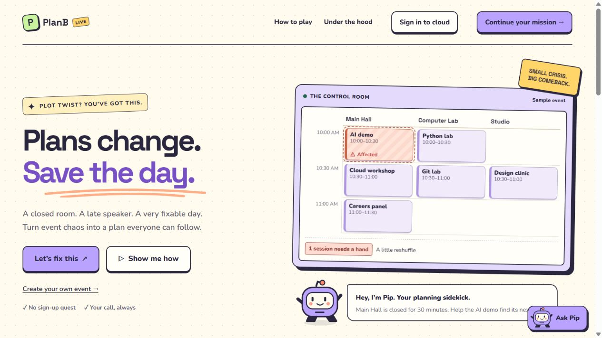
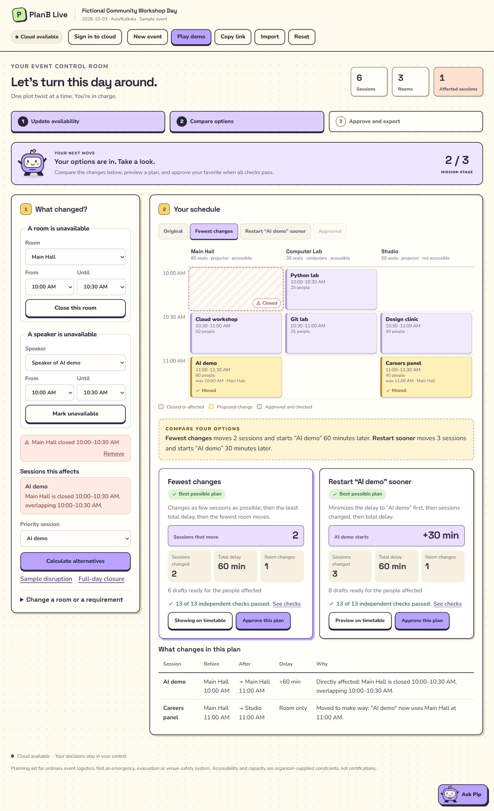
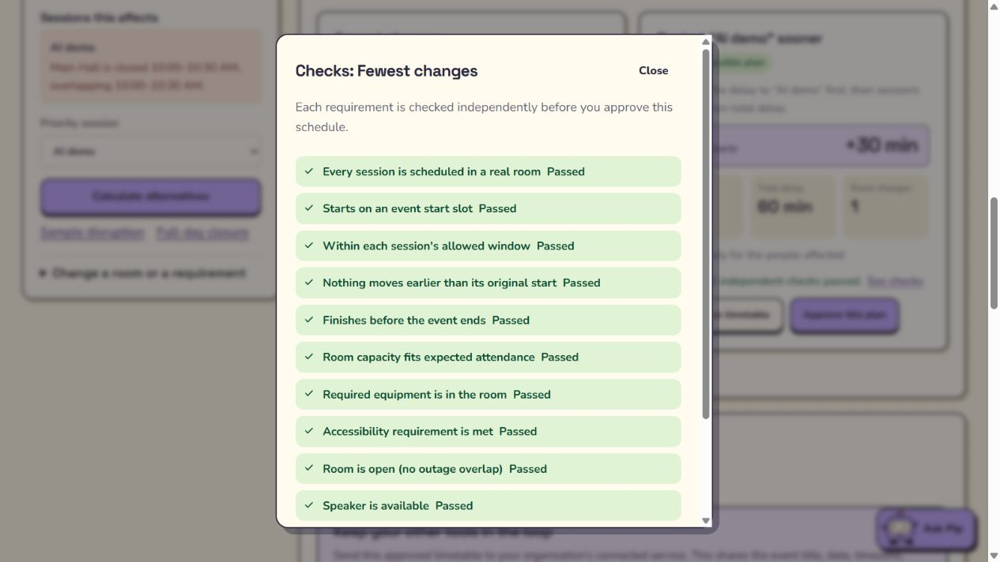
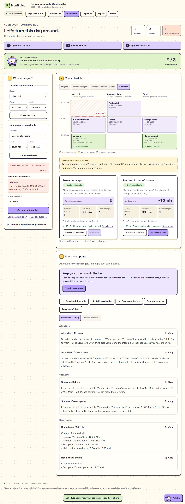
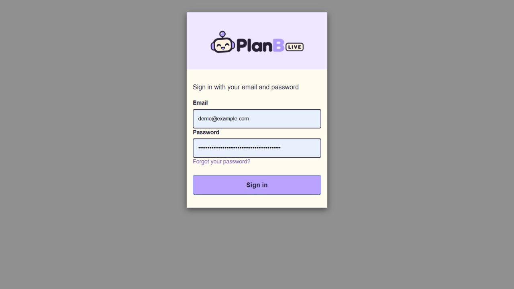
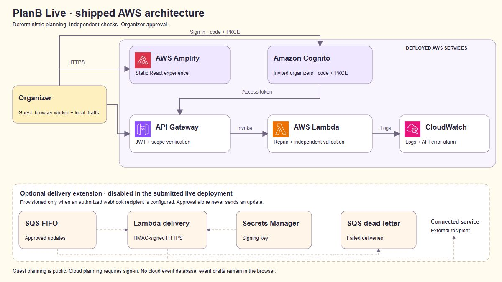

# PlanB Live

When a room closes or a speaker is late, PlanB Live rebuilds one event day and shows the cost of each repair. The organizer compares two checked plans, approves one, and exports it. Nothing is emailed or posted until a signed-in organizer chooses to send it.

**Live site:** [main.d3offbwjw6r5g0.amplifyapp.com](https://main.d3offbwjw6r5g0.amplifyapp.com)

Guest planning runs in the browser. Cloud repair, sign-in, and optional delivery use the AWS deployment below.



## What it does

- Close a room or mark a speaker unavailable, or import a session spreadsheet and edit the rooms yourself.
- Compare **Fewest changes** with **Restart the priority session sooner**.
- Run the same proposal through 13 independent checks before approval.
- Export a timetable, a calendar file, a run of show, and copy-ready updates for attendees, speakers, and room teams.
- Keep drafts in this browser. A shareable link carries the plan. It does not create an account.

The sample day is a fictional Community Workshop Day. Main Hall is closed from 10:00 to 10:30. Fewest changes moves 2 sessions and starts AI demo 60 minutes later. Restarting AI demo sooner moves 3 sessions and starts it 30 minutes later. Both totals are 60 minutes of delay and 1 room change. Your own event produces its own numbers.



## Checks before approval

Every proposed assignment is checked again, separately from the search that produced it. A plan that fails a check cannot be approved.



1. Every session is scheduled in a real room.
2. Starts on an event start slot.
3. Stays inside that session's allowed window.
4. Nothing moves earlier than its original start.
5. Finishes before the event ends.
6. Room capacity fits the expected attendance.
7. Required equipment is in the room.
8. The accessibility requirement is met.
9. The room is open for the whole session.
10. The speaker is available.
11. No two sessions share a room at the same time.
12. No speaker is double-booked.
13. Locked sessions stay where they are locked.

The search reports one of these statuses:

| Status | Meaning |
| --- | --- |
| `OPTIMAL` | The search proved this is the best plan for the chosen goal. |
| `FEASIBLE` | A checked plan was found, and the search stopped at its budget. |
| `INFEASIBLE` | No plan satisfies the constraints. |
| `SEARCH_LIMIT` | The search stopped before it could prove a result. This is not the same as impossible. |
| `INVALID_INPUT` | The event itself needs attention before a search can run. |

Sessions are not dropped to make a plan fit. Capacity, accessibility, and equipment are not relaxed.

## Approve, then share on purpose

Approval stays on this machine. The export panel copies updates and downloads files. It does not send them.



A signed-in organizer can send the approved timetable to one organization-managed HTTPS recipient. The live deployment has no recipient connected, so that button explains that delivery is not set up. Connecting one is a deploy-time choice, not something the guest demo does.

## Sign-in

Cloud planning uses Amazon Cognito. Self-registration is off. An operator invites organizers. The hosted page uses the PlanB logo and the same cream and lavender colors as the app. Guest planning does not require an account.



## Architecture

The browser holds the event draft. Amplify serves the page. Signed-in repair and validation go through API Gateway to one Lambda. CloudWatch keeps the logs. Gemini is outside AWS and is called only by `/assist` when a key is set. The repair itself never calls a model.

The dashed box is optional. SQS, the delivery Lambda, Secrets Manager, and the dead-letter queue are created only when an operator sets a webhook URL. Approval alone never sends an update.



| Piece | Role |
| --- | --- |
| Browser | Guest planning in a Web Worker. Drafts stay local. |
| AWS Amplify | Hosts the static build. The live site is the `main` branch. |
| Amazon S3 | Private bucket for deployment artifacts. The event plan is not stored there. |
| Amazon Cognito | Invited organizers, authorization-code flow with PKCE, optional authenticator MFA. |
| Amazon API Gateway | HTTP API. JWT and the `planb/write` scope protect cloud routes. |
| AWS Lambda | Node.js 22 on arm64. Repair, validation, and optional explain. |
| Amazon CloudWatch | Function logs, API access logs, and error alarms. |
| AWS IAM | Function roles for logs and, when delivery is on, queue and secret access. |
| AWS CloudFormation | Deploys `infra/hosting.yaml` and `infra/template.yaml`. |
| Amazon SQS, Secrets Manager, second Lambda | Optional signed webhook path. Off unless `WebhookUrl` is set. |
| Google Gemini | Explains the current board. It cannot invent a timetable. |

There is no event database. One plan is one calendar date and one time zone.

## Limits

| Limit | Value |
| --- | --- |
| Sessions | 200 |
| Rooms | 40 |
| Start slots | 288 |
| Session length | 5 to 480 minutes |
| Room or session size | up to 5,000 people |
| Equipment tags | 32 per room or session |

One plan does not cover a second day, travel time, setup buffers, or recurring events. This is a planning aid for ordinary event logistics. It is not an emergency, evacuation, or venue-safety system. Accessibility and capacity are the constraints the organizer enters.

## Run it locally

```sh
npm ci
npm run dev
npm run check
```

`npm run check` typechecks, runs the tests, builds the frontend, and builds the Lambda bundles.

Copy `.env.example` to `.env.local` only if you want the local app to call a deployed API or a local model key. Leave the values empty and the guest workspace still plans. Do not commit `.env.local` or `.env.production`.

## What is in this repo

| Path | What it is |
| --- | --- |
| `src/` | React workspace, worker, repair engine, and Pip. |
| `api/` | Lambda handlers for repair, validation, explain, and optional delivery. |
| `infra/` | Amplify hosting and the SAM backend. |
| `tests/` | Engine, auth, workspace, and webhook checks. |
| `readme/` | The screenshots and architecture diagram on this page. |

## Deploy notes

`infra/hosting.yaml` creates the Amplify app and a private artifact bucket. `infra/template.yaml` creates Cognito, the HTTP API, the planning Lambda, logs, and alarms. Pass `AllowedOrigin` as the Amplify origin and a unique `AuthDomainPrefix`. Leave `WebhookUrl` and `GeminiApiKey` empty to keep delivery and the model off. `scripts/publish-aws.ps1` rebuilds the site from the stack outputs and starts an Amplify deployment. A started job still has to finish before the site is updated.
